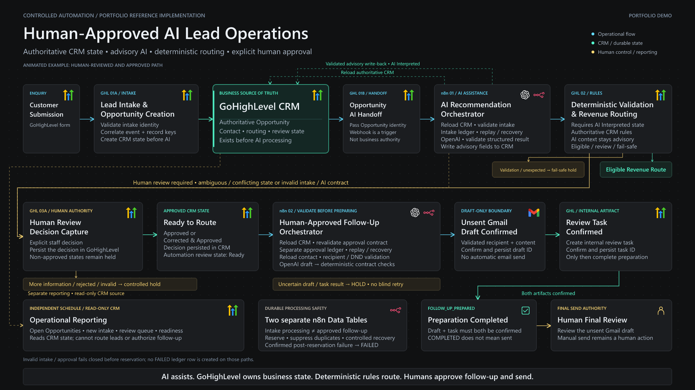
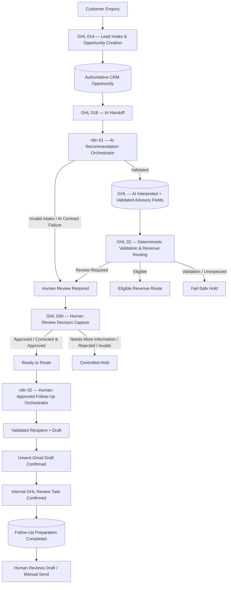
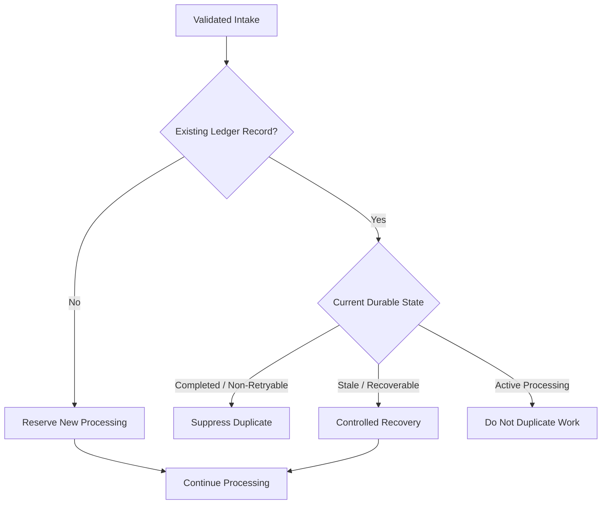
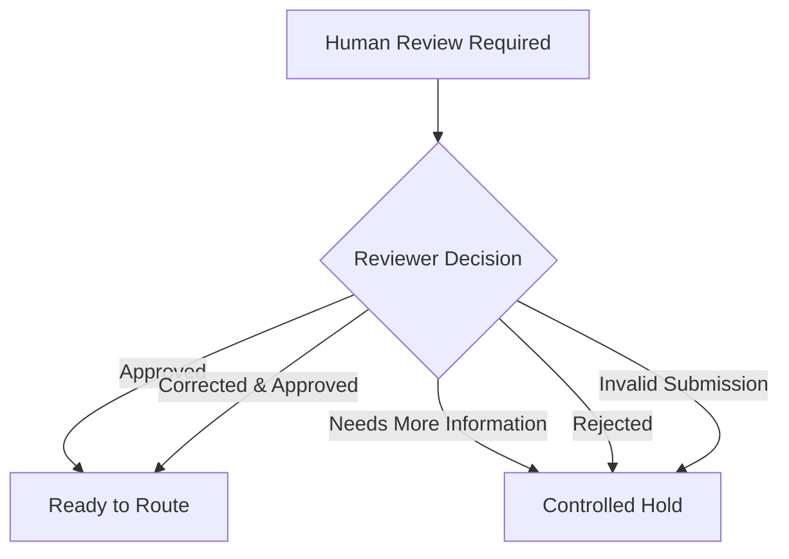

# System Architecture


The Human-Approved AI Lead Operations system separates **CRM authority**, **deterministic business logic**, **AI assistance**, **workflow orchestration**, and **human approval** into distinct control layers.

The design is intentionally not an autonomous AI agent.

> **AI assists. GoHighLevel owns business state. Deterministic rules control routing. Humans authorize customer-facing follow-up.**

---

## Architectural objectives

The system is designed around six operational requirements:

1. Establish authoritative CRM state before AI processing
2. Prevent webhook payloads from becoming unchecked business truth
3. Separate probabilistic AI recommendations from deterministic routing
4. Detect duplicate delivery and support controlled recovery
5. Require explicit human authorization before follow-up preparation
6. Avoid unsafe retries when external side effects cannot be confirmed

---

## Component responsibilities

| Component | Primary responsibility |
|---|---|
| **GoHighLevel** | CRM system of record, Opportunity state, pipeline stages, deterministic routing, review decisions, internal tasks |
| **n8n** | Cross-system orchestration, authoritative-state validation, idempotency, recovery, AI workflow control, durable processing state |
| **OpenAI** | Structured intake recommendations and constrained follow-up draft generation |
| **Gmail** | Stores an unsent follow-up draft for human review |
| **n8n Data Tables** | Durable processing ledgers for intake and approved follow-up |
| **Webhooks / REST APIs** | Controlled handoff between GoHighLevel and n8n |

---

## Architecture at a glance



The two n8n orchestrators perform substantial internal validation and state control, but those details remain inside the workflow boundary rather than expanding the high-level system diagram.

---

## Authority model

The architecture distinguishes four different forms of authority.

### CRM authority

GoHighLevel is authoritative for operational business state, including:

- contact identity
- Opportunity identity
- submitted enquiry data
- pipeline
- stage
- Opportunity status
- routing state
- automation review status
- human-review decision

n8n does not replace the CRM as the source of business truth.

### Deterministic authority

Business routing is evaluated with deterministic rules against authoritative CRM data.

This layer decides whether an Opportunity can follow an eligible revenue route, requires human review, or must enter fail-safe handling.

### AI authority

AI has advisory authority only.

It may:

- summarize an enquiry
- suggest a revenue stream
- suggest a location
- provide a confidence score
- suggest operational priority
- recommend a next action
- explain its recommendation
- prepare approved follow-up draft content

It may not independently:

- override authoritative CRM data
- authorize a revenue route
- approve an Opportunity
- authorize customer communication
- send customer-facing email

### Human authority

Humans resolve cases that require explicit review and retain final authority over customer-facing follow-up.

For the human-approved follow-up path, the authority chain is:

```text
Customer Submission
        ↓
Authoritative CRM State
        ↓
Authoritative-State Validation
        ↓
AI Advisory Assistance
        ↓
Deterministic Business Routing
        ↓
Human Review when required
        ↓
Explicit Approval for follow-up
        ↓
Controlled Follow-Up Preparation
        ↓
Human Review of Draft / Manual Send
```

---

## GHL 01A — Lead Intake & Opportunity Creation

The intake boundary begins inside GoHighLevel.

```text
Form Submission
      ↓
Generate Event Identity
      ↓
Validate Intake Identity
      ↓
Mark Contact as Automation Managed
      ↓
Create Authoritative Opportunity
      ↓
Set AI Processing State
```

The key architectural decision is that the **CRM Opportunity exists before AI interpretation begins**.

This prevents the AI layer from becoming responsible for creating the authoritative business record.

### Intake identity

Each accepted intake receives correlated identifiers:

- `Source Event ID`
- `External Record Key`

These identifiers establish a traceable relationship between the original intake event, the CRM Opportunity, the n8n execution, and persistent ledger state.

If the required identity contract cannot be established, processing fails closed.

---

## GHL 01B — Intake Opportunity AI Handoff

The handoff workflow sends the Opportunity identity to n8n.

The incoming webhook is intentionally treated as a **trigger**, not as complete authoritative state.

The handoff establishes which Opportunity needs processing; n8n then retrieves the current record directly from GoHighLevel.

This prevents stale, incomplete, or manipulated webhook fields from automatically becoming downstream business truth.

---

## n8n 01 — AI Recommendation Orchestrator

The first n8n workflow provides the controlled AI-processing layer.

Its internal sequence is conceptually:

```text
Webhook Trigger
      ↓
Authoritative CRM Reload
      ↓
Normalize CRM State
      ↓
Validate Intake Contract
      ↓
Check Durable Processing Ledger
      ↓
Reserve / Suppress / Recover
      ↓
Structured AI Recommendation
      ↓
Validate AI Output Contract
      ↓
Write Advisory Fields to CRM
      ↓
Move Opportunity to AI Interpreted
      ↓
Persist Completion
```

### Authoritative CRM reload

The workflow retrieves the current Opportunity directly from GoHighLevel before making important processing decisions.

Validation includes the expected operational state and the identifiers required to correlate the intake.

The webhook payload therefore cannot independently authorize AI processing.

### Intake contract validation

The workflow verifies that the record contains the required state for processing.

Depending on the current contract, this includes concepts such as:

- valid Opportunity identity
- valid contact identity
- expected pipeline
- expected stage
- expected Opportunity status
- required intake fields
- valid processing state
- correlated event identity

Invalid authoritative state prevents normal continuation.

---

## Durable idempotency and replay control

Webhook delivery is not assumed to occur exactly once.

Before expensive processing begins, n8n checks a persistent intake-processing ledger.



The ledger provides durable operational memory across separate n8n executions.

It tracks concepts such as:

- external record identity
- source event identity
- Opportunity
- contact
- processing status
- first execution
- last execution
- last-seen time
- replay count
- result code
- failure reason

This architecture reduces duplicate processing without claiming mathematically exactly-once execution across independent external systems.

---

## Structured AI recommendation

The model receives normalized CRM context only after the authoritative and idempotency checkpoints pass.

Its output is constrained to a structured schema.

The recommendation can include:

- intake summary
- suggested revenue stream
- suggested location
- confidence
- suggested priority
- suggested next action
- recommendation reason

Controlled fields use restricted vocabularies rather than unrestricted free-form values.

The workflow then performs its own validation of the returned structure.

```text
Authoritative CRM Context
        ↓
Structured AI Request
        ↓
Schema-Constrained Result
        ↓
Workflow Contract Validation
        ↓
Valid Advisory Result
```

A model response is not accepted merely because the AI call completed successfully.

Invalid output fails the workflow contract.

---

## Validated CRM handoff

Only a validated recommendation can be written back to GoHighLevel.

The stored AI fields remain advisory.

The CRM record is then prepared for the deterministic routing layer.

This creates an explicit boundary:

> **AI interpretation finishes before authoritative business routing begins.**

---

## GHL 02 — Deterministic Lead Validation & Revenue Routing

GoHighLevel owns the routing decision.

The routing workflow evaluates authoritative CRM state and separates processing into four conceptual outcomes:

| Outcome | Purpose |
|---|---|
| **Eligible Revenue Route** | Submitted business state satisfies deterministic routing requirements |
| **Human Review Required** | State is ambiguous, conflicting, unsupported, or requires staff judgment |
| **Validation Fail-Safe** | Required validation contract failed |
| **Unexpected Decision Fail-Safe** | Evaluator returned a state outside the expected routing contract |

AI output may contribute context, but the AI recommendation does not directly move the Opportunity into its authoritative route.

This is the main separation between **probabilistic classification** and **business control**.

---

## GHL 03A — Human Review Decision Capture

Review-required cases enter an explicit human decision boundary.

Supported outcomes include:

- `Approved`
- `Corrected & Approved`
- `Needs More Information`
- `Rejected`
- invalid review submission handling

Approved states can progress to `Ready to Route`.

Non-approved or invalid states remain controlled rather than continuing into customer follow-up.



The decision is persisted to GoHighLevel before n8n performs any approved follow-up work.

---

## n8n 02 — Human-Approved Follow-Up Orchestrator

The second n8n workflow is deliberately separate from intake interpretation.

Its purpose is not to decide whether a lead should be approved.

Its purpose is to safely prepare follow-up **after approval already exists in the authoritative CRM**.

Conceptually:

```text
Approved-State Webhook
        ↓
Reload Authoritative Opportunity
        ↓
Validate Human Approval Contract
        ↓
Check Approval Processing Ledger
        ↓
Reserve / Suppress / Recover
        ↓
Reload Intended Contact
        ↓
Validate Recipient
        ↓
Generate Controlled Draft
        ↓
Validate Draft Contract
        ↓
Create Unsent Gmail Draft
        ↓
Confirm + Persist Gmail Draft ID
        ↓
Create Internal GHL Review Task
        ↓
Confirm Review Task
        ↓
Persist Follow-Up Completion
```

---

## Human approval contract

The webhook indicating that an Opportunity is ready is not sufficient authorization by itself.

n8n reloads the Opportunity and validates the authoritative state.

The contract includes concepts such as:

- expected pipeline
- expected `Ready to Route` state
- valid Opportunity status
- allowed human decision
- expected automation review status
- correlated source-event identity

Only an authoritative approved state can continue.

---

## Approval idempotency

Approved follow-up uses a separate persistent ledger from intake processing.

This is important because intake interpretation and approved follow-up are different operational transactions.

The approval-processing identity represents the approved business-state snapshot being acted upon.

Repeated delivery can therefore be distinguished from genuinely new approved state.

The follow-up ledger persists concepts such as:

- approval idempotency key
- original intake identity
- Opportunity
- contact
- review decision
- processing status
- execution history
- replay count
- Gmail draft ID
- GHL task ID
- completion timestamp
- failure reason

---

## Recipient safety

Before draft generation can continue, n8n reloads the intended contact from GoHighLevel.

The recipient contract verifies:

- contact identity
- email presence
- valid email structure
- DND / communication eligibility where applicable

An uncertain recipient does not receive a draft artifact.

The workflow fails closed instead.

---

## Controlled follow-up drafting

The model receives only approved operational context.

Drafting instructions are intentionally constrained.

The model is not permitted to invent unsupported business or clinical information such as:

- pricing
- discounts
- availability
- appointment times
- unsupported offers
- guarantees
- clinical recommendations
- treatment suitability
- health efficacy claims

The generated subject and body must then pass deterministic validation before Gmail is called.

AI therefore prepares content inside an approved operational boundary rather than independently communicating with the customer.

---

## Draft-only communication boundary

The Gmail integration creates a **draft**.

It does not send the message.

```text
Validated Human Approval
        ↓
Validated Recipient
        ↓
Validated Draft
        ↓
Unsent Gmail Draft
        ↓
Internal GHL Review Task
        ↓
Human Final Review
        ↓
Human Send
```

The confirmed Gmail draft identifier is persisted before downstream processing continues.

This creates a durable record that the external artifact was successfully created.

---

## External side-effect safety

Creating Gmail drafts and GoHighLevel review tasks are external side effects.

Those operations require different failure handling from pure validation logic.

The architecture distinguishes between:

### FAILED

Used when a reserved processing transaction reaches a confirmed failure and no uncertain external write needs to be protected.

Examples:

- AI provider failure or invalid AI output after intake reservation
- invalid recipient
- invalid follow-up draft

Authoritative-intake validation and human-approval validation occur before their respective ledger reservations. Those paths fail closed, but they do not create a persisted `FAILED` ledger row.

### HOLD

Used when an external side effect may have occurred but cannot be confirmed safely.

Examples:

- Gmail returned an uncertain draft-creation result
- GoHighLevel returned an uncertain review-task result

In a HOLD state, the system avoids blindly replaying the external action.

This reduces the risk of duplicate drafts or duplicate operational tasks.

---

## Completion contract

Approved follow-up is complete only when all required downstream artifacts are confirmed.

```text
Human Approval = Valid
        ↓
Recipient = Valid
        ↓
Draft = Valid
        ↓
Gmail Draft = Confirmed
        ↓
GHL Review Task = Confirmed
        ↓
Processing Status = COMPLETED
        ↓
Result Code = FOLLOW_UP_PREPARED
```

`COMPLETED` means the follow-up package was prepared successfully.

It does **not** mean a customer email was sent.

Final send authority remains human.

---

## Operational reporting

Reporting is intentionally separate from transactional lead processing.

The scheduled operations view reads CRM state to summarize operational workload such as:

- open Opportunities
- new intake
- human-review queue
- routing readiness

Reporting does not determine routing and does not authorize follow-up.

This separation prevents reporting concerns from affecting transactional automation.

---

## Reliability model

The architecture uses several complementary controls rather than relying on one mechanism:

| Control | Purpose |
|---|---|
| Authoritative CRM reload | Prevent stale webhook state from controlling decisions |
| Contract validation | Reject malformed or unexpected business state |
| Restricted AI schemas | Limit probabilistic output to known operational shapes |
| Deterministic routing | Keep business routing outside model authority |
| Durable processing ledgers | Preserve state across executions |
| Replay classification | Suppress or deliberately recover repeated events |
| Human approval | Keep sensitive business decisions under human authority |
| Recipient validation | Prevent drafting to an invalid or unintended recipient |
| Draft-only Gmail action | Prevent autonomous customer communication |
| HOLD semantics | Avoid unsafe retries after uncertain external writes |

No individual control provides the entire safety model.

The architecture relies on the combination.

---

## Public repository boundary

The public portfolio exposes the system design and demonstrated behavior without publishing environment-specific implementation material.

### Included publicly

- architecture documentation
- semantic data contracts
- workflow screenshots
- successful execution evidence
- human-review evidence
- draft-only follow-up evidence
- operational reporting evidence

### Intentionally excluded

- raw n8n workflow exports
- credentials and API keys
- OAuth configuration
- private integration tokens
- internal account identifiers
- GoHighLevel field IDs
- pipeline and stage IDs
- Data Table IDs
- webhook IDs
- temporary tunnel URLs
- raw execution payloads

The public repository therefore demonstrates the architecture without exposing reusable secrets or account-specific configuration.
