# Human-Approved AI Lead Operations

A controlled lead-operations system built with **GoHighLevel and n8n**, combining deterministic CRM automation, AI-assisted interpretation, durable processing controls, and explicit human approval.

GoHighLevel remains the authoritative system of record for customer data, Opportunity state, routing, and review decisions. n8n handles orchestration, authoritative-state validation, replay control, structured AI processing, and approved follow-up preparation.

AI recommendations are advisory. They do not independently control revenue routing or customer communication. Ambiguous or conflicting enquiries can be held for human review, and customer-facing follow-up is prepared only after an approved CRM state is independently validated.

The final follow-up is created as an **unsent Gmail draft** with an internal GoHighLevel review task. A human retains final send authority.

> **Portfolio Demo / Reference Implementation**
> This repository documents the architecture, control model, implementation evidence, and demonstrated operation. Environment-specific workflow exports, credentials, private IDs, and webhook configuration are intentionally excluded.

---

## What this system handles

- Creates an authoritative CRM Opportunity before AI processing begins
- Correlates each intake with durable event and record identities
- Reloads current CRM state before important automation decisions
- Uses structured AI output with restricted operational vocabularies
- Separates AI recommendations from deterministic revenue routing
- Detects duplicate deliveries and supports controlled recovery
- Routes uncertain cases into human review or fail-safe handling
- Requires explicit approval before follow-up preparation
- Validates the intended recipient before drafting
- Creates an unsent Gmail draft instead of sending automatically
- Creates an internal GoHighLevel review task
- Persists processing outcomes in durable n8n ledgers
- Provides scheduled operational reporting

---

## System flow

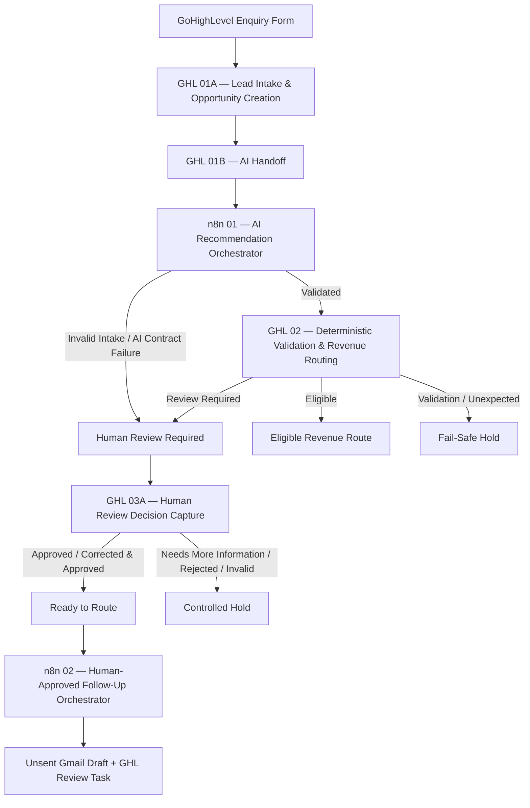

The architecture deliberately separates **probabilistic interpretation** from **authoritative business decisions**.

AI can recommend. GoHighLevel controls routing. Human approval controls whether follow-up preparation is allowed.

**Operational reporting runs separately from the transactional workflows**, reading CRM state to surface intake volume, review workload, and routing readiness without affecting lead processing.

---

## Workflow structure

### GHL 01A — Lead Intake & Opportunity Creation

The intake workflow receives the designated GoHighLevel form submission, generates a correlated event identity, validates the intake, marks the contact as automation-managed, and creates the authoritative Opportunity in the Intake & Review pipeline.

AI processing begins only after the CRM record exists.

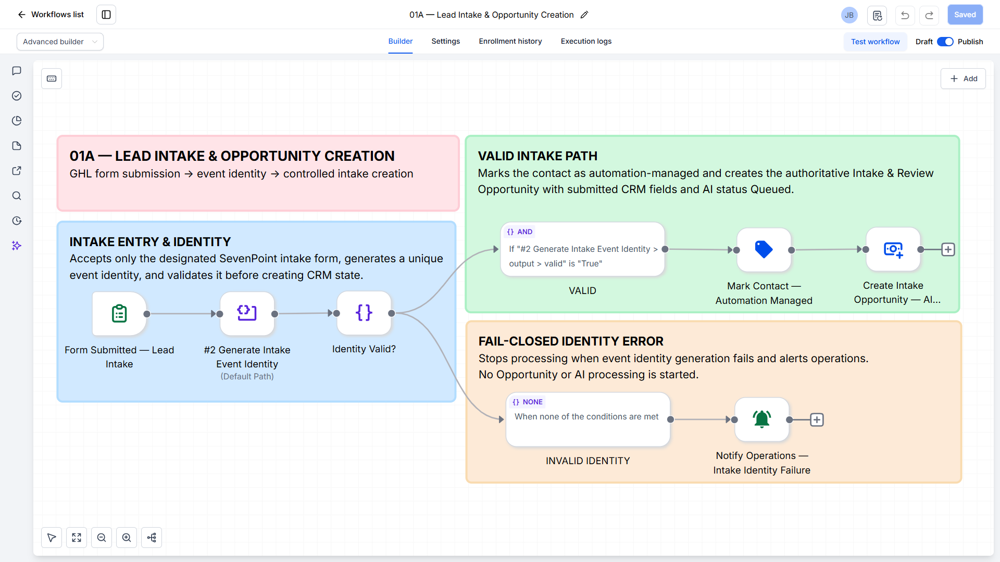

---

### GHL 01B — Intake Opportunity AI Handoff

The handoff workflow detects the newly created intake Opportunity and passes its identity to n8n.

The webhook acts as a trigger. n8n does not treat the incoming payload as complete business truth; the current Opportunity is reloaded directly from GoHighLevel before downstream processing.

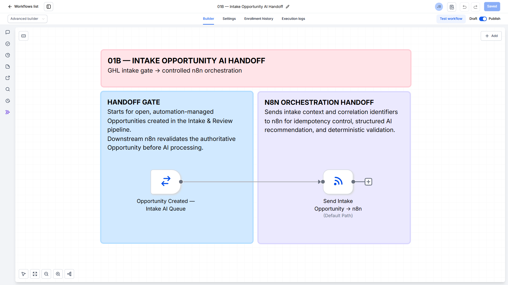

---

### n8n 01 — AI Recommendation Orchestrator

The first n8n orchestrator provides the AI-assisted interpretation layer.

Before calling the model, the workflow:

- reloads authoritative CRM state
- validates the intake contract
- verifies event correlation
- checks durable processing state
- detects duplicate delivery
- determines whether recovery is safe

The model returns structured operational recommendations using controlled values for revenue stream, location, priority, and next action.

Returned output is independently validated before advisory fields are written back to GoHighLevel.

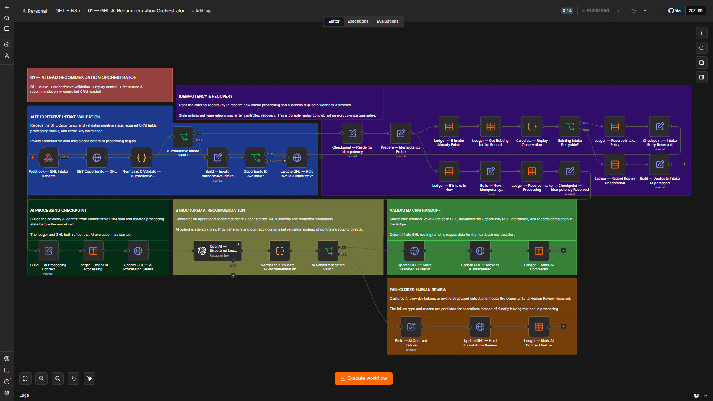

---

### GHL 02 — Deterministic Lead Validation & Revenue Routing

GoHighLevel performs the authoritative business-routing decision after AI interpretation.

The workflow evaluates submitted CRM data and separates outcomes into:

- eligible revenue routing
- human review required
- validation fail-safe
- unexpected decision fail-safe

AI output can inform operations, but it does not directly determine the final revenue route.

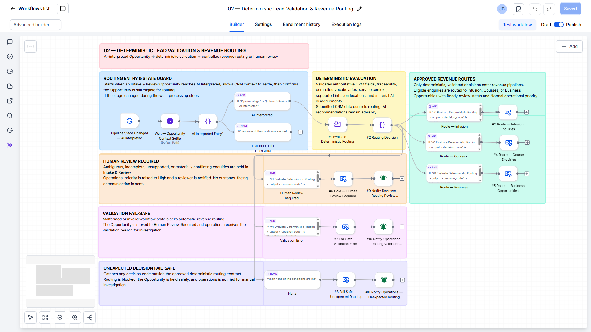

---

### GHL 03A — Human Review Decision Capture

Cases that cannot safely continue automatically are held for explicit human review.

Supported review outcomes include:

- Approved
- Corrected & Approved
- Needs More Information
- Rejected
- Invalid Review Submission

Only approved states are eligible for the follow-up preparation workflow.

The decision is written to GoHighLevel first so the CRM remains authoritative.

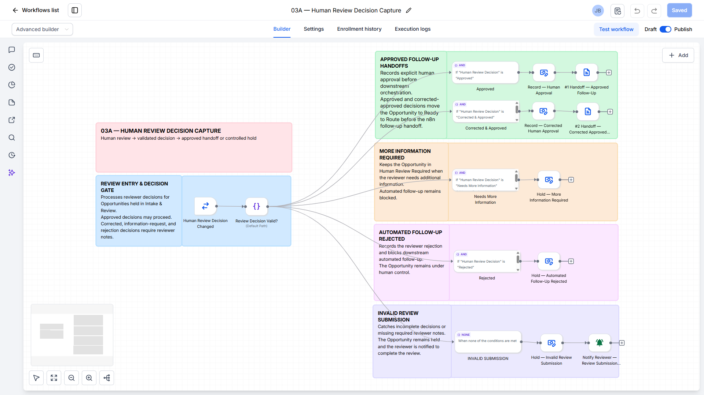

---

### n8n 02 — Human-Approved Follow-Up Orchestrator

The second n8n orchestrator starts from an approved CRM state.

Before generating follow-up content, it independently validates:

- the authoritative Opportunity
- the human approval contract
- the expected routing state
- event correlation
- durable approval-processing state
- the intended recipient

Only then can AI generate a constrained follow-up draft.

The workflow validates the draft, creates an **unsent Gmail draft**, creates an internal GoHighLevel review task, and persists completion state.

It does not automatically send customer-facing email.

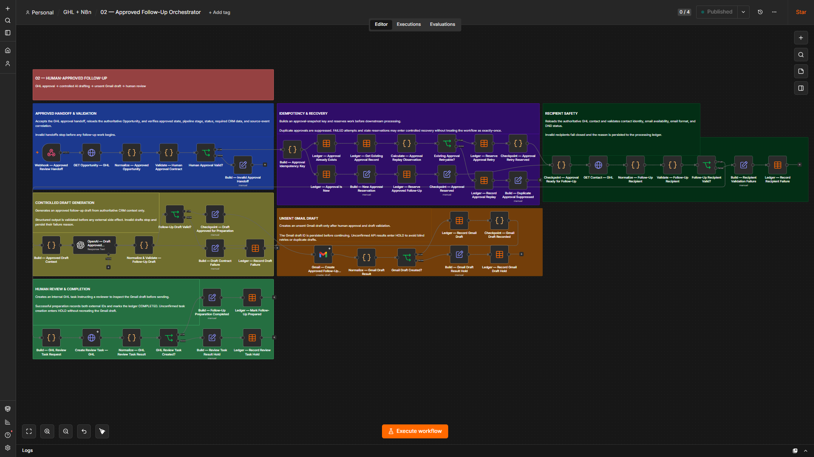

---

## Controls and safeguards

The system is designed around explicit authority and failure boundaries.

### Authoritative CRM reload

n8n reloads current GoHighLevel records before important decisions instead of relying solely on webhook payloads.

### AI is advisory

AI can summarize, classify, recommend, and draft. It cannot independently authorize revenue routing or customer communication.

### Structured output contracts

AI responses must conform to defined schemas and restricted operational vocabularies before being accepted.

### Deterministic routing

Revenue routing is evaluated separately from AI interpretation using authoritative CRM state.

### Human exception handling

Ambiguous, conflicting, unsupported, or review-required cases can be held for explicit human decision.

### Human-approved follow-up

Only an approved CRM state can authorize follow-up preparation.

### Recipient safety

The intended contact is reloaded and validated before a Gmail draft can be created.

### Draft-only communication

The workflow creates an unsent Gmail draft. Final customer communication remains a human action.

### Durable idempotency and replay control

Persistent n8n Data Tables track processing identity, state, execution history, replay observations, result codes, and failures.

Duplicate events can therefore be suppressed or recovered deliberately instead of being processed blindly.

### Fail closed

Invalid authoritative state, invalid AI output, invalid approval, invalid recipient, or invalid draft prevents normal continuation.

### HOLD for uncertain side effects

When an external action may have occurred but cannot be confirmed safely, the workflow can enter HOLD rather than blindly retrying and risking duplicate artifacts.

The design therefore does not claim mathematically exactly-once execution across external systems.

---

## Demonstrated operation

### Successful AI intake processing

A completed n8n execution demonstrates the successful path through authoritative CRM validation, replay control, structured AI processing, contract validation, CRM handoff, and durable completion.

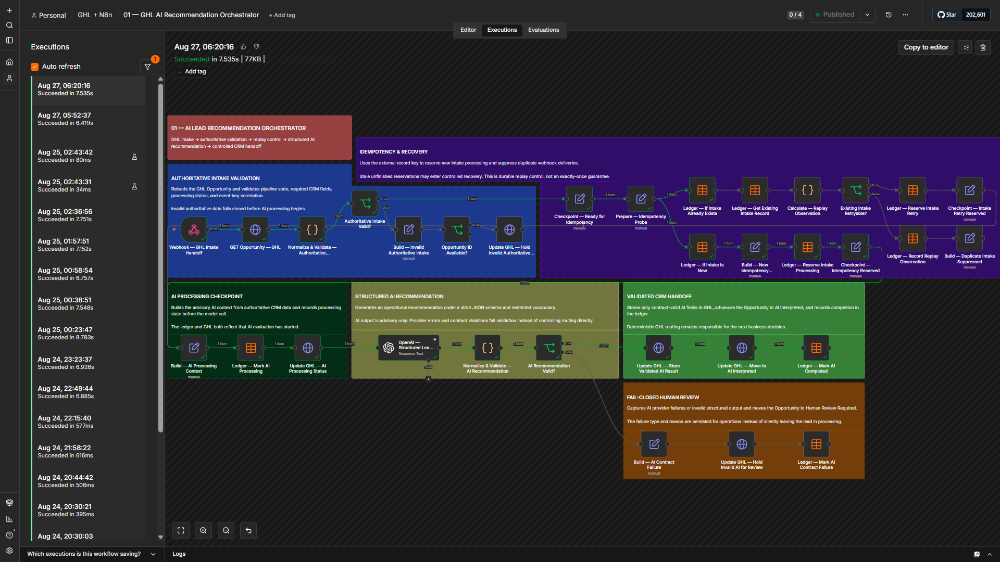

---

### Ready-to-route CRM state

After deterministic routing and human approval, the controlled test Opportunity reached the **Ready to Route** state in GoHighLevel.

This stage is the authorization boundary for the approved follow-up orchestrator.

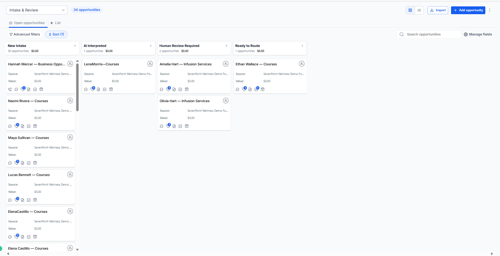

---

### Draft-only customer follow-up

The approved follow-up workflow produced an **unsent Gmail draft**.

The message remained available for human review rather than being sent automatically.

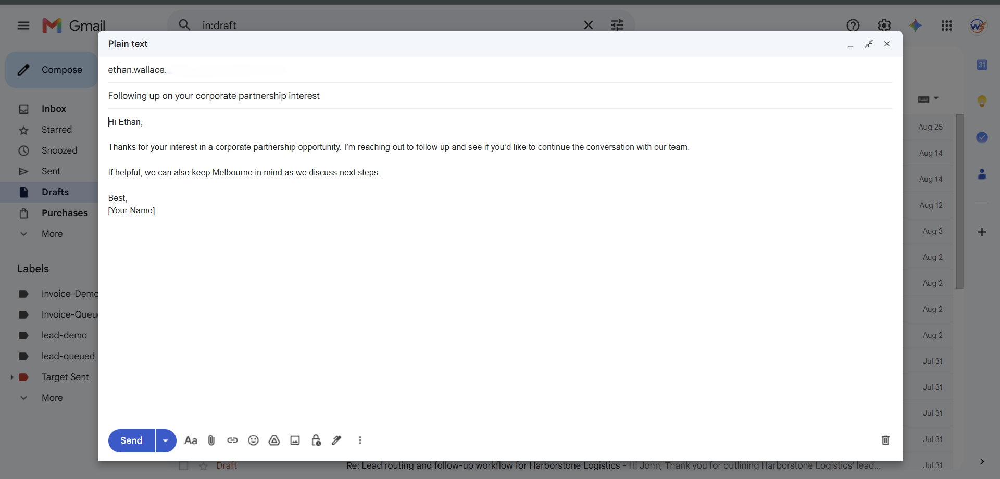

---

### Operational reporting

A scheduled operations summary provides visibility into the current workload, including open Opportunities, new intake, human-review demand, and routing readiness.

Reporting is deliberately separated from transactional processing.

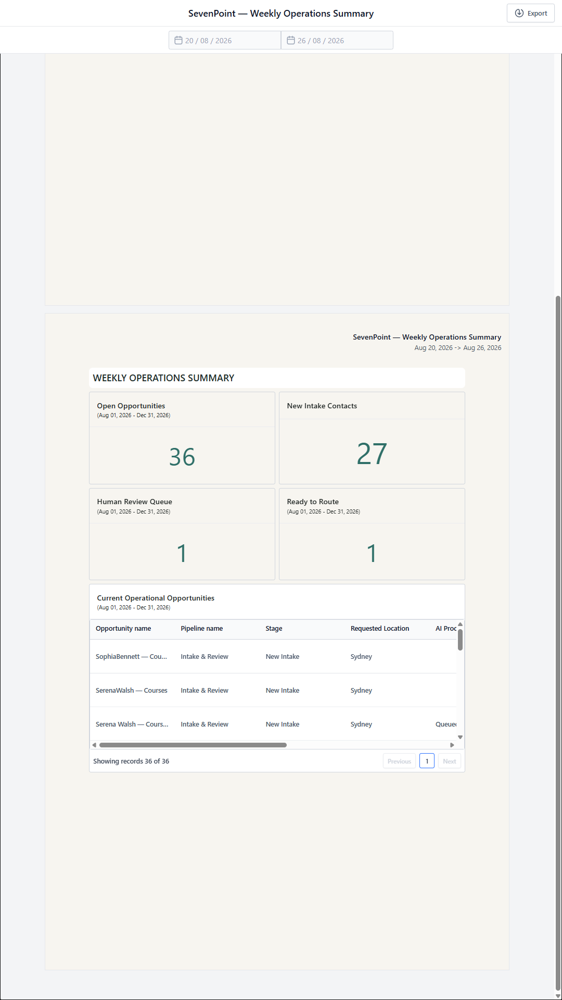

---

## Technology

- **GoHighLevel** — CRM, form intake, Opportunities, deterministic routing, human review, internal tasks
- **n8n** — orchestration, validation, AI workflow control, idempotency, recovery, persistent processing state
- **OpenAI** — structured intake interpretation and constrained follow-up drafting
- **Gmail** — unsent human-reviewable follow-up drafts
- **n8n Data Tables** — durable intake and approved-follow-up processing ledgers
- **Webhooks / REST APIs** — controlled cross-system handoff

---

## Repository contents

```text
.
├── README.md
├── ARCHITECTURE.md
├── DATA_DICTIONARY.md
├── evidence/
│   ├── workflows/
│   │   ├── 01-ghl-lead-intake.png
│   │   ├── 02-ghl-ai-handoff.png
│   │   ├── 03-n8n-ai-orchestrator.png
│   │   ├── 04-ghl-deterministic-routing.png
│   │   ├── 05-ghl-human-review.png
│   │   └── 06-n8n-human-approved-follow-up.png
│   ├── execution/
│   │   ├── 01-n8n-ai-successful-execution.png
│   │   └── 02-ready-to-route.png
│   ├── follow-up/
│   │   └── 01-gmail-unsent-draft.png
│   └── reporting/
│       └── 01-weekly-operations-summary.png
└── .gitignore
```

Raw workflow exports and environment-specific implementation files are intentionally kept outside the public repository.

---

## Documentation

For the technical design and control boundaries:

- [System Architecture](ARCHITECTURE.md)
- [Data Dictionary](DATA_DICTIONARY.md)

---

## Public portfolio note

This repository is a **portfolio demo / reference implementation**, not a claim of production work performed for a client.

Screenshots and documentation demonstrate the implemented workflow architecture and controlled test behavior.

Public materials intentionally exclude:

- credentials and API keys
- OAuth configuration
- private integration tokens
- raw workflow exports
- internal account and location IDs
- pipeline and stage IDs
- custom-field IDs
- Data Table IDs
- webhook identifiers
- temporary development URLs
- raw execution payloads